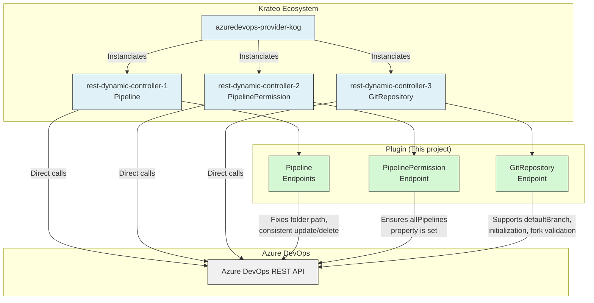

# Krateo Azure DevOps Plugin for `rest-dynamic-controller`

A specialized web service that addresses some inconsistencies in the Azure DevOps REST API
It is designed to work with the [`rest-dynamic-controller`](https://github.com/krateoplatformops/rest-dynamic-controller/) and [`azuredevops-provider-kog`](https://github.com/krateoplatformops/azuredevops-provider-kog-chart).

## Summary

- [Summary](#summary)
- [Architecture](#architecture)
- [API Endpoints](#api-endpoints)
  - [Pipeline](#pipeline)
    - [Get Pipeline](#get-pipeline)
    - [Update Pipeline](#update-pipeline)
    - [Delete Pipeline](#delete-pipeline)
  - [PipelinePermission](#pipelinepermission)
    - [Get PipelinePermission](#get-pipelinepermission)
  - [GitRepository](#gitrepository)
    - [Create GitRepository](#create-gitrepository)
- [Swagger Documentation](#swagger-documentation)
- [Azure DevOps API Reference](#azuredevops-api-reference)
- [Authentication](#authentication)

## Architecture

The diagram below illustrates how the Krateo Azure DevOps Plugin interacts within the Krateo ecosystem, including the `rest-dynamic-controller` and the `azuredevops-provider-kog` as well as the Azure DevOps REST API.



## API Endpoints

### Pipeline

#### Get Pipeline

**Description**:
This endpoint retrieves a specific pipeline by its ID in the specified Azure DevOps project.
It returns the pipeline details, including its ID, name, and other metadata.

<details>
<summary><b>Why This Endpoint Exists</b></summary>
<br/>

- The standard Azure DevOps REST API return the `folder` field with an "escaped backslash" as prefix like `"folder":"\\test-folder"`.
- This endpoint returns the `folder` field without the "escaped backslash" prefix, allowing a correct comparison with the `folder` field set in the `spec` of the `Pipeline` resource.

</details>

<details>
<summary><b>Request</b></summary>
<br/>

```http
GET /api/{organization}/{project}/pipelines/{id}
```

**Path parameters**:
- `organization` (string, required): The name of the Azure DevOps organization.
- `project` (string, required): The name of the Azure DevOps project.
- `id` (string, required): The ID of the pipeline to retrieve.

**Query parameters**:
- `api-version` (string, required): The version of the Azure DevOps REST API to use. For example, `7.2-preview.1`.

</details>

<details>
<summary><b>Response</b></summary>
<br/>

**Response status codes**:
- `200 OK`: The request was successful and the pipeline details are returned.
- `400 Bad Request`: The request is invalid. Ensure that the `organization`, `project`, and `id` parameters are correct.
- `401 Unauthorized`: The request is not authorized. Ensure that the `Authorization` header is set correctly.
- `500 Internal Server Error`: An unexpected error occurred while processing the request.

**Response body example**:
```json
{
  "_links":{
    "self":{
      "href":"string"
      },
    "web":{
      "href":"string"
    }
  },
  "configuration":{
    "path":"pipelines/test_inner_pipeline.yml",
    "repository":{
      "id":"string",
      "type":"azureReposGit"
    },
    "type":"yaml"
  },
  "folder":"test-folder-kog", // Adjusted field
  "id":49,
  "name":"test-pipeline-kog-1",
  "revision":1,
  "url":"string"
}
```

</details>

---

#### Update Pipeline

**Description**:
This endpoint updates an existing pipeline in the specified Azure DevOps project.
In particular, it allows you to change the pipeline's name, folder, and configuration details such as the path to the configuration file.

<details>
<summary><b>Why This Endpoint Exists</b></summary>
<br/>

- The standard Azure DevOps REST API does not have a `/pipelines/{id}` endpoint for updating pipelines.
- In order to update a pipeline, you need to use the `/build/definitions/{id}` endpoint, which is not consistent with the `/pipelines/{id}` endpoint used for retrieving pipelines.
- This endpoint provides a consistent way to update pipelines using the `/pipelines/{id}` endpoint and the same request body schema as the `POST /pipelines` endpoint of Azure DevOps REST API.
- In particular, the plugin creates a `BuildDefinitionMinimal` object starting from the request body and then performs a `PUT` request to the `/build/definitions/{id}` endpoint of Azure DevOps REST API.
- A needed adjustement related to the repository type is performed, as the Azure DevOps REST API returns different values for the `repository.type` field depending on the endpoint used to retrieve the pipeline. For instance, even if a pipeline is linked to a `azureReposGit` repository, the `/build/definitions/{id}` endpoint returns `repository.type` as `TfsGit`, while the `/pipelines/{id}` endpoint returns `repository.type` as `azureReposGit`.
- Moreover, since this endpoint under the hood uses the `/build/definitions/{id}` Azure DevOps endpoint, the plugin set the correct `api-version` parameter needed to update a pipeline using the `/build/definitions/{id}` endpoint (`7.2-preview.7`).

> Currently, the `api-version` parameter is passed as an environment variable to the plugin by the related Helm chart.

</details>

<details><summary><b>Request</b></summary>
<br/>

```http
PUT /api/{organization}/{project}/pipelines/{id}
```

**Path parameters**:
- `organization` (string, required): The name of the Azure DevOps organization.
- `project` (string, required): The name of the Azure DevOps project.
- `id` (string, required): The ID of the pipeline to update.

**Request body example**:
```json
{
  "configuration":{
    "path":"pipelines/inner_folder/another_config.yml",
    "repository":{
      "id":"string",
      "type":"azureReposGit"
    },
    "type":"yaml"
  },
  "folder":"test-folder-kog",
  "name":"test-pipeline-kog-1-v2",
  "revision":"3"
}
```

</details>

<details><summary><b>Response</b></summary>
<br/>

**Response status codes**:
- `200 OK`: The pipeline was successfully updated.
- `400 Bad Request`: The request body is invalid or the pipeline ID does not exist.
- `401 Unauthorized`: The request is not authorized. Ensure that the `Authorization` header is set correctly.
- `404 Not Found`: The specified pipeline does not exist in the project.
- `500 Internal Server Error`: An unexpected error occurred while processing the request.

**Response body example**:
```json
{
  "_links":{
    "self":{
      "href":"string"
      },
    "web":{
      "href":"string"
    }
  },
  "configuration":{
    "path":"pipelines/test_inner_pipeline.yml",
    "repository":{
      "id":"string",
      "type":"azureReposGit" // Adjusted field
    },
    "type":"yaml"
  },
  "folder":"test-folder-kog", // Adjusted field
  "id":49,
  "name":"test-pipeline-kog-1",
  "revision":1,
  "url":"string"
}
```

</details>

---

#### Delete Pipeline

**Description**:
This endpoint deletes a specific pipeline by its ID in the specified Azure DevOps project.

<details>
<summary><b>Why This Endpoint Exists</b></summary>
<br/>

- The standard Azure DevOps REST API does not have a `/pipelines/{id}` endpoint for deleting pipelines.
- In order to delete a pipeline, you need to use the `/build/definitions/{id}` endpoint, which currently support a different `api-version` parameter when compared to the `/pipelines/{id}` endpoint used for retrieving pipelines.
- This endpoint sets the correct `api-version` parameter needed to delete a pipeline using the `/build/definitions/{id}` endpoint (`7.2-preview.7`).

> Currently, the `api-version` parameter is passed as an environment variable to the plugin by the related Helm chart.

</details>

<details><summary><b>Request</b></summary>
<br/>

```http
DELETE /api/{organization}/{project}/pipelines/{id}
```

**Path parameters**:
- `organization` (string, required): The name of the Azure DevOps organization.
- `project` (string, required): The name of the Azure DevOps project.
- `id` (string, required): The ID of the pipeline to delete.

</details>

<details><summary><b>Response</b></summary>
<br/>

**Response status codes**:
- `204 No Content`: The pipeline was successfully deleted.
- `400 Bad Request`: The request is invalid or the pipeline ID does not exist.
- `401 Unauthorized`: The request is not authorized. Ensure that the `Authorization` header is set correctly.
- `404 Not Found`: The specified pipeline does not exist in the project.
- `500 Internal Server Error`: An unexpected error occurred while processing the request.

</details>

---

### PipelinePermission

#### Get PipelinePermission

**Description**: 
Given a `ResourceType` and `ResourceId`, it returns authorized definitions for that resource.
More precisely, it returns the list of `pipelines` that have permissions to access the specified resource and the fact whether `allPipelines` have access to it.

<details>
<summary><b>Why This Endpoint Exists</b></summary>
<br/>

- The standard Azure DevOps REST API does not return the `allPipelines` property when said property is set to `authorized: false` on Azure DevOps (default behavior).
- This endpoint checks if the response from the Azure DevOps REST API contains the `allPipelines` property and, if not, it adds it with a value of `authorized: false`.

</details>

<details>
<summary><b>Request</b></summary>
<br/>

```http
GET /api/{organization}/{project}/pipelines/pipelinepermissions/{resourceType}/{resourceId}
```

**Path parameters**:
- `organization` (string, required): The name of the Azure DevOps organization.
- `project` (string, required): The name of the Azure DevOps project.
- `resourceType` (string, required): The type of resource for which permissions are being requested (e.g., `repository`, `environment`, `queue`).
- `resourceId` (string, required): The ID of the resource for which permissions are being requested.

**Query parameters**:
- `api-version` (string, required): The version of the Azure DevOps REST API to use. For example, `7.2-preview.2`.
</details>

<details>
<summary><b>Response</b></summary>
<br/>

**Response status codes**:
- `200 OK`: The request was successful.
- `401 Unauthorized`: The request is not authorized. Ensure that the `Authorization` header is set correctly.
- `500 Internal Server Error`: An unexpected error occurred while processing the request.

**Response body example**:
```json
{
  "resource": {
    "type":"environment",
    "id":"7"
  },
  "allPipelines":{
    "authorized":false // Adjusted field
  },
  "pipelines": [
    {
      "id":14,
      "authorized":true,
      "authorizedBy": {
        "displayName":"<REDACTED>",
        "id":"<REDACTED>",
        "uniqueName":"<REDACTED>",
        "descriptor":"<REDACTED>"
      },
      "authorizedOn":"2025-06-30T14:33:02.06Z"
    },
    {
      "id":15,
      "authorized":true,
      "authorizedBy": {
        "displayName":"<REDACTED>",
        "id":"<REDACTED>",
        "uniqueName":"<REDACTED>",
        "descriptor":"<REDACTED>"
      },
      "authorizedOn":"2025-06-30T14:33:02.06Z"
    }
  ]
}
```
</details>

---

### GitRepository

#### Create GitRepository

**Description**:
This endpoint creates a new GitRepository in the specified Azure DevOps project.
It allows you to specify the `initialize` field to indicate whether the repository should be initialized with a first commit. (Note: you cannot initialize a repository with a first commit if you are forking a repository).
It allows you to specify the `defaultBranch` field to set the default branch of the repository.

<details>
<summary><b>Why This Endpoint Exists</b></summary>
<br/>

- The standard Azure DevOps REST API has two different request body schemas for creating (`POST`) and updating (`PATCH`) Git repositories. In particular, the field `defaultBranch` is only available in the `PATCH` request body.
- This endpoint allows you to create a Git repository with the `defaultBranch` field, which is not supported in the standard Azure DevOps REST API for the `POST` request body. Practially performing a `PATCH` operation on the repository immediately after creation.
- Moreover, it allows you to initialize the repository with a first commit by setting the `initialize` field to `true`.
- In addition, it performs additional validations related to branch existence (for forks) and repository initialization.
- Another additional validation is that it checks if the `sourceRef` branch exists in the parent repository when forking a repository. If it does not exist, it returns a `400 Bad Request` error.

</details>

<details>
<summary><b>Request</b></summary>
<br/>

```http
POST /api/{organization}/{projectId}/git/repositories
```

**Path parameters**:
- `organization` (string, required): The name of the Azure DevOps organization.
- `projectId` (string, required): The ID or name of the Azure DevOps project.

**Query parameters**:
- `api-version` (string, required): The version of the Azure DevOps REST API to use. For example, `7.2-preview.2`.
- `sourceRef` (string, optional): The source reference for the repository. This is typically a branch name (e.g., `refs/heads/main`).

**Request body example**:
```json
{
  "name": "string",
  "defaultBranch": "string",    // Adjusted field
  "initialize": true,           // Adjusted field

  // From here, optional, fork-related fields:
  "parentRepository": {
    "id": "4b8c6f64-5717-4562-b3fc-2c963f66afa6",
    "project": {
      "id": "3fa85f64-5717-4562-b3fc-2c963f66afa6",
    }
  },
  "project": {
    "id": "3fa85f64-5717-4562-b3fc-2c963f66afa6",
  }
}
```

> The field `projectId` (path parameter) can be either the project ID or the project name. The fields `project.id` and `parentRepository.project.id` in the request body must be the project ID (not the project name) and are required when forking a repository. If you are not forking a repository, you have to omit these fields.

</details>

<details>
<summary><b>Response</b></summary>
<br/>

**Response status codes**:
- `201 Created`: The GitRrepository was successfully created.
- `202 Accepted`: The GitRrepository was successfully created but `defaultBranch` specified in the request body does not exist in the repository.
- `400 Bad Request`: The request body is invalid, the `sourceRef` branch does not exist in the parent repository or other validation errors occurred.
- `401 Unauthorized`: The request is not authorized. Ensure that the `Authorization` header is set correctly.
- `500 Internal Server Error`: An unexpected error occurred while processing the request.

**Response body example**:
```json
{
  "_links": {
    "links": {
      "additionalProp1": {},
      "additionalProp2": {},
      "additionalProp3": {}
    }
  },
  "creationDate": "2025-07-06T12:28:03.454Z",
  "defaultBranch": "string",
  "id": "3fa85f64-5717-4562-b3fc-2c963f66afa6",
  "isDisabled": true,
  "isFork": true,
  "isInMaintenance": true,
  "name": "string",
  "parentRepository": {
    "collection": {
      "avatarUrl": "string",
      "id": "3fa85f64-5717-4562-b3fc-2c963f66afa6",
      "name": "string",
      "url": "string"
    },
    "id": "3fa85f64-5717-4562-b3fc-2c963f66afa6",
    "isFork": true,
    "name": "string",
    "project": {
      "abbreviation": "string",
      "defaultTeamImageUrl": "string",
      "description": "string",
      "id": "3fa85f64-5717-4562-b3fc-2c963f66afa6",
      "lastUpdateTime": "2025-07-06T12:28:03.454Z",
      "name": "string",
      "revision": 0,
      "state": "deleting",
      "url": "string",
      "visibility": "private"
    },
    "remoteUrl": "string",
    "sshUrl": "string",
    "url": "string"
  },
  "project": {
    "abbreviation": "string",
    "defaultTeamImageUrl": "string",
    "description": "string",
    "id": "3fa85f64-5717-4562-b3fc-2c963f66afa6",
    "lastUpdateTime": "2025-07-06T12:28:03.454Z",
    "name": "string",
    "revision": 0,
    "state": "deleting",
    "url": "string",
    "visibility": "private"
  },
  "remoteUrl": "string",
  "size": 0,
  "sshUrl": "string",
  "url": "string",
  "validRemoteUrls": [
    "string"
  ],
  "webUrl": "string"
}
```

</details>


### PullRequest


TODO

 GET
/{organization}/{project}/_apis/git/repositories/{repositoryId}/pullrequests


changed the query parameters, removing the prefix "searchCriteria."
So for example "searchCriteria.status" became just "status"


## Swagger Documentation

For more detailed information about the API endpoints, please refer to the Swagger documentation available at `/swagger/index.html` endpoint of the service.

## Azure DevOps API Reference

For complete Azure DevOps REST API documentation, visit: [Azure DevOps REST API docs](https://learn.microsoft.com/en-us/rest/api/azure/devops/) and [API Specifications](https://github.com/MicrosoftDocs/vsts-rest-api-specs/tree/master).

## Authentication

The plugin will forward the `Authorization` header passed in the request to this plugin to the Azure DevOps REST API.
In particular, it supports the Basic Authentication scheme, which is the default for Azure DevOps REST API.
How it works:
- You can generate a Personal Access Token (PAT) in Azure DevOps.
- Use the PAT as the password in the Basic Authentication header.
- The username can be any string (e.g., `user`), as Azure DevOps does not require a specific username for PAT authentication.

You can get more information in the README of the [`azuredevops-provider-kog`](https://github.com/krateoplatformops/azuredevops-provider-kog-chart#authentication).
